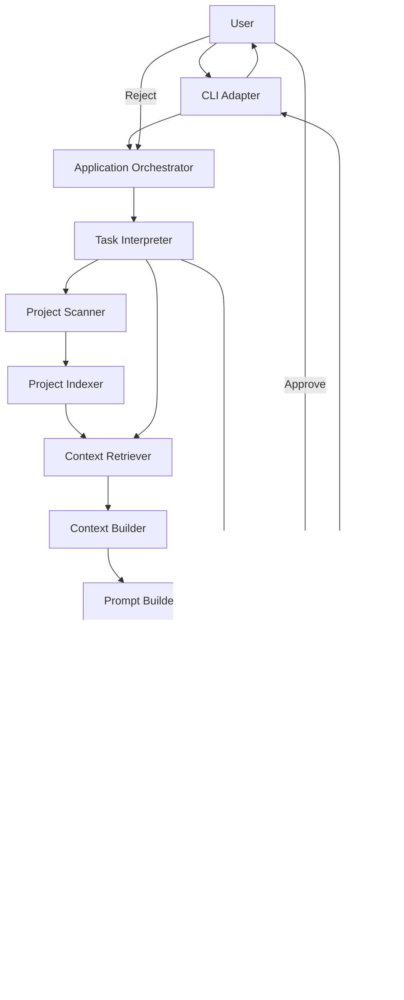

# System Architecture

Document ID: CF-003
Status: Frozen
Version: 1.0.0
Owner: ContextForge Architecture Board
Language: English
Audience:

* Engineers
* Contributors
* Product Owners
* AI Agents

Normative: Yes

Depends On:

* CF-000 — AI-Native Specification
* CF-001 — Vision
* CF-002 — Product Requirements Document

Related ADRs:

* ADR-0001 — Context-First Architecture
* ADR-0002 — Hexagonal Architecture
* ADR-0003 — Dependency Rule
* ADR-0004 — Feature-Based Module Organization

---

# Abstract

This document defines the logical architecture of ContextForge.

It specifies the architectural components, responsibilities, boundaries, dependency rules, execution flow, ports, adapters, and requirement traceability required for the Minimum Viable Product.

Implementation-specific decisions are intentionally excluded and SHALL be defined in subsequent specifications.

---

# Architectural Goal

The ContextForge architecture SHALL satisfy the functional and non-functional requirements defined in CF-002 while preserving:

* Provider independence.
* Context-first design.
* Deterministic analysis.
* High cohesion.
* Low coupling.
* Testability.
* Replaceable external integrations.
* Controlled extensibility.

The architecture SHALL support the central product objective:

> Select and deliver the minimum sufficient context required to execute a software engineering task.

---

# Architectural Identity

ContextForge is a Context Engineering Engine.

Its primary responsibility is to decide which project information is relevant to a task and to deliver that information in a structured form suitable for inference.

ContextForge SHALL NOT treat code generation as a Core responsibility.

Code generation SHALL be delegated to an external inference provider through the Provider Port.

The architectural pipeline is:

```text
Repository
    |
    v
Discovery
    |
    v
Knowledge
    |
    v
Decision
    |
    v
Context
    |
    v
Inference
    |
    v
Patch
```

---

# Architectural Style

ContextForge SHALL adopt Hexagonal Architecture, also known as Ports and Adapters.

The architecture SHALL be divided into:

* Core capabilities.
* Application orchestration.
* Ports.
* Adapters.

The Core SHALL remain independent from:

* User interfaces.
* Inference providers.
* Storage technologies.
* File system implementations.
* Network protocols.
* External frameworks.

External systems SHALL communicate with the Core exclusively through defined ports.

---

# Dependency Rule

Dependencies SHALL point toward the Core.

The Core SHALL NOT depend directly on:

* The CLI.
* Ollama.
* OpenAI.
* Any other inference provider.
* A file system implementation.
* A database implementation.
* A network client.
* An external framework.

Adapters SHALL depend on Core contracts.

Core contracts SHALL NOT depend on adapter implementations.

Circular dependencies between architectural capabilities SHALL NOT be permitted.

---

# Architectural Principles

## AP-001 — Single Responsibility

Every architectural component SHALL have one primary responsibility.

---

## AP-002 — Requirement Justification

Every architectural component SHALL satisfy at least one approved product requirement.

Components without requirement traceability SHALL NOT be introduced.

---

## AP-003 — Explicit Dependencies

Every dependency between components SHALL be explicit and represented through a defined contract.

---

## AP-004 — Core Ownership

Context selection, context construction, validation rules, and other product decisions SHALL reside in the Core.

---

## AP-005 — Replaceable Integrations

External technologies SHALL be replaceable without requiring changes to Core business rules.

---

## AP-006 — Deterministic Before Generative

Deterministic project analysis SHALL precede generative inference whenever equivalent information can be obtained without a language model.

---

## AP-007 — Inference as an External Capability

Inference SHALL be treated as an external service accessed through a provider-independent port.

---

## AP-008 — Explainable Context Selection

The architecture SHALL preserve sufficient information to explain why each artifact was included in a Context Bundle.

---

## AP-009 — Immutable Context Delivery

A finalized Context Bundle SHALL be immutable during a single inference operation.

---

## AP-010 — Explicit Modification Approval

No project modification SHALL occur without explicit user approval.

---

# System Context

The primary external actors are:

| Actor               | Responsibility                                               |
| ------------------- | ------------------------------------------------------------ |
| User                | Submits tasks, reviews patches, and authorizes modifications |
| Project Repository  | Provides source files and project metadata                   |
| Inference Provider  | Produces proposed modifications                              |
| File System Adapter | Reads and writes project artifacts                           |
| CLI Adapter         | Exposes the MVP interaction interface                        |

The logical interaction is:

```text
User
  |
  v
CLI Adapter
  |
  v
Application Orchestrator
  |
  v
ContextForge Core
  |
  +-------------------+
  |                   |
  v                   v
Repository Adapter    Provider Adapter
  |                   |
  v                   v
Project Repository    Inference Provider
```

---

# Core Capabilities

The MVP Core SHALL contain the following capabilities:

| Capability               | Primary Responsibility                                           |
| ------------------------ | ---------------------------------------------------------------- |
| Project Scanner          | Discover project artifacts                                       |
| Project Indexer          | Transform discovered artifacts into structured project knowledge |
| Task Interpreter         | Normalize the user request into a task representation            |
| Context Retriever        | Select the minimum relevant project information                  |
| Context Builder          | Assemble an immutable Context Bundle                             |
| Prompt Builder           | Produce a provider-ready inference request                       |
| Patch Engine             | Validate, present, and apply proposed modifications              |
| Application Orchestrator | Coordinate the execution workflow                                |

The Provider Port is an architectural boundary and SHALL NOT contain provider-specific behavior.

---

# Capability Boundaries

## Project Scanner

The Project Scanner SHALL discover the contents and structural characteristics of a project.

It SHALL identify:

* Files.
* Directories.
* Supported source artifacts.
* Relevant configuration artifacts.
* Repository metadata.
* Excluded paths.

The Project Scanner SHALL NOT:

* Rank artifact relevance.
* Parse inference responses.
* Build prompts.
* Modify project files.

Primary output:

* Project Inventory.

---

## Project Indexer

The Project Indexer SHALL transform the Project Inventory into structured project knowledge.

It MAY produce:

* File metadata.
* Symbol information.
* Import relationships.
* Dependency relationships.
* Language metadata.
* Structural references.

The Project Indexer SHALL NOT:

* Select task-specific context.
* Invoke an inference provider.
* Apply patches.

Primary output:

* Project Index.

---

## Task Interpreter

The Task Interpreter SHALL convert a natural-language user request into a normalized Task Specification.

The Task Specification SHALL preserve the original user instruction.

The Task Interpreter MAY identify:

* Requested operation.
* Referenced files or symbols.
* Explicit constraints.
* Expected outcome.

The Task Interpreter SHALL NOT generate source code or infer unrequested product behavior.

Primary output:

* Task Specification.

---

## Context Retriever

The Context Retriever SHALL select the minimum project information relevant to the Task Specification.

It SHALL use the Project Index and available project artifacts.

The Context Retriever SHALL:

* Rank candidate artifacts.
* Select relevant artifacts.
* preserve selection rationale;
* enforce configured context limits;
* avoid unrelated project content.

The Context Retriever is the primary decision capability of ContextForge.

It SHALL NOT:

* Format provider-specific prompts.
* Invoke providers.
* Modify project artifacts.

Primary output:

* Retrieval Result.

---

## Context Builder

The Context Builder SHALL transform the Retrieval Result into an immutable Context Bundle.

A Context Bundle MAY contain:

* Task information.
* Selected source excerpts.
* File paths.
* Symbol metadata.
* Dependency information.
* Selection rationale.
* Context size metadata.

The Context Builder SHALL include only content authorized by the Retrieval Result.

It SHALL NOT independently retrieve additional artifacts.

Primary output:

* Context Bundle.

---

## Prompt Builder

The Prompt Builder SHALL convert a Task Specification and Context Bundle into a provider-ready inference request.

It SHALL remain independent of specific provider implementations.

The Prompt Builder SHALL NOT:

* Perform project scanning.
* Rank artifacts.
* Modify the Context Bundle.
* Apply patches.

Primary output:

* Inference Request.

---

## Provider Port

The Provider Port SHALL define the contract used to execute inference.

Provider adapters SHALL implement this port.

The contract SHALL support:

* Provider identification.
* Inference request submission.
* Response retrieval.
* Provider error reporting.
* Usage metadata when available.

The Core SHALL NOT distinguish local providers from remote providers through business logic.

Primary output:

* Inference Response.

---

## Patch Engine

The Patch Engine SHALL process proposed modifications returned by an inference provider.

It SHALL be responsible for:

* Parsing proposed modifications.
* Validating patch structure.
* Detecting invalid target paths.
* Detecting unsupported modifications.
* Producing a reviewable patch representation.
* Applying approved modifications.
* Reporting application failures.

The Patch Engine SHALL NOT apply modifications before explicit approval.

Primary outputs:

* Patch Proposal.
* Patch Application Result.

---

## Application Orchestrator

The Application Orchestrator SHALL coordinate the execution of Core capabilities.

It SHALL manage workflow progression and failure propagation.

It SHALL NOT contain:

* Artifact ranking rules.
* Provider-specific behavior.
* Patch validation rules.
* Project parsing rules.
* Context selection rules.

Business rules SHALL remain within the capability that owns them.

---

# Execution Flow

The standard MVP execution flow SHALL be:

1. The user submits a natural-language task.
2. The CLI Adapter forwards the request to the Application Orchestrator.
3. The Task Interpreter creates a Task Specification.
4. The Project Scanner discovers project artifacts.
5. The Project Indexer builds or loads the Project Index.
6. The Context Retriever selects relevant information.
7. The Context Builder creates an immutable Context Bundle.
8. The Prompt Builder creates an Inference Request.
9. The Provider Port invokes the configured provider adapter.
10. The provider returns an Inference Response.
11. The Patch Engine validates the proposed modifications.
12. The CLI Adapter presents the Patch Proposal.
13. The user approves or rejects the proposal.
14. The Patch Engine applies approved changes.
15. The system reports the Patch Application Result.

The workflow SHALL terminate safely when any required stage fails.

---

# Execution Flow Diagram



---

# Ports

The Core SHALL define the following logical ports:

| Port              | Purpose                                          |
| ----------------- | ------------------------------------------------ |
| ProjectSourcePort | Read project artifacts and repository metadata   |
| ProviderPort      | Execute inference                                |
| PatchTargetPort   | Apply approved project modifications             |
| ApprovalPort      | Obtain explicit user authorization               |
| OutputPort        | Present results, diagnostics, and patch previews |

Scanner, indexing, retrieval, context construction, prompt construction, and patch validation are Core capabilities and SHALL NOT require adapter contracts unless they communicate with an external system.

Ports SHALL define contracts only.

Ports SHALL NOT contain implementation-specific behavior.

---

# Adapters

Adapters SHALL connect external technologies to Core ports.

MVP adapters SHALL include:

| Adapter                   | Port                                  |
| ------------------------- | ------------------------------------- |
| CLI Adapter               | ApprovalPort and OutputPort           |
| Local File System Adapter | ProjectSourcePort and PatchTargetPort |
| Ollama Adapter            | ProviderPort                          |
| Remote Provider Adapter   | ProviderPort                          |

The specific remote provider SHALL be selected in the provider specification.

Adapters SHALL NOT contain Core business rules.

Adapters MAY translate external data formats into Core models.

---

# Data Flow

The principal architectural artifacts SHALL flow in the following order:

```text
User Request
    |
    v
Task Specification
    |
    +--------------------+
    |                    |
    v                    v
Project Inventory    Project Index
                         |
                         v
                  Retrieval Result
                         |
                         v
                   Context Bundle
                         |
                         v
                  Inference Request
                         |
                         v
                  Inference Response
                         |
                         v
                    Patch Proposal
                         |
                         v
              Patch Application Result
```

Each artifact SHALL have a single authoritative producer.

---

# Error Boundaries

Each capability SHALL report errors using Core-defined failure types.

The architecture SHALL distinguish at least:

* Project discovery failure.
* Unsupported project artifact.
* Index generation failure.
* Invalid task specification.
* No relevant context found.
* Context limit exceeded.
* Provider unavailable.
* Provider response invalid.
* Patch validation failure.
* Patch conflict.
* User rejection.
* Patch application failure.

Adapter-specific exceptions SHALL be translated before crossing into the Core.

Raw framework or provider exceptions SHALL NOT propagate through Core boundaries.

---

# Context Selection Explainability

For every selected artifact, the Retrieval Result SHOULD retain:

* Artifact identifier.
* Selection reason.
* Relevance score or rank, when applicable.
* Relationship to the task.
* Relationship to other selected artifacts.

Explainability data SHALL be available for user-facing diagnostics but SHALL NOT be required inside every provider prompt.

---

# Security and Safety Boundaries

The architecture SHALL enforce the following safety constraints:

* Project paths SHALL be validated before access.
* Patch targets SHALL remain inside the authorized project root.
* Path traversal SHALL be rejected.
* Binary files SHALL NOT be modified unless explicitly supported.
* User approval SHALL precede every write operation.
* Provider output SHALL be treated as untrusted input.
* Invalid or ambiguous patches SHALL NOT be applied.
* Sensitive project content SHOULD NOT be sent to remote providers without explicit configuration.

Detailed security requirements belong to CF-013.

---

# Module Organization

The source code SHALL be organized by capability rather than by generic technical layers.

Expected top-level capability modules include:

```text
src/contextforge/
    application/
    scanner/
    indexer/
    task/
    retrieval/
    context/
    prompt/
    provider/
    patch/
    cli/
```

Generic directories such as the following SHALL NOT be introduced:

```text
utils/
helpers/
common/
```

Shared code SHALL belong to the capability that owns its semantics or to an explicitly defined Core contract.

---

# Traceability Matrix

The following matrix maps the PRD requirement groups to architectural capabilities.

| Architectural Capability   | PRD Requirement Group |
| -------------------------- | --------------------- |
| Project Scanner            | FR-ANALYSIS           |
| Project Indexer            | FR-ANALYSIS           |
| Task Interpreter           | FR-TASK               |
| Context Retriever          | FR-CONTEXT            |
| Context Builder            | FR-CONTEXT            |
| Prompt Builder             | FR-INFERENCE          |
| Provider Port and Adapters | FR-INFERENCE          |
| Patch Engine               | FR-PATCH              |
| CLI Adapter                | FR-INTERACTION        |
| Application Orchestrator   | FR-WORKFLOW           |

Non-functional requirement traceability:

| Non-Functional Requirement | Architectural Mechanism                         |
| -------------------------- | ----------------------------------------------- |
| Provider independence      | Provider Port and replaceable provider adapters |
| Offline operation          | Local file system and local provider adapters   |
| Token minimization         | Context Retriever and Context Builder           |
| Deterministic analysis     | Scanner and Indexer before inference            |
| Explainability             | Retrieval rationale                             |
| Modularity                 | Capability boundaries and explicit ports        |
| Extensibility              | Replaceable adapters                            |
| Cross-platform operation   | Platform-independent Core contracts             |

Exact requirement identifiers SHALL remain defined by CF-002.

---

# Architectural Constraints

The MVP architecture SHALL NOT require:

* Cloud infrastructure.
* Proprietary inference services.
* A database server.
* A graphical interface.
* IDE integration.
* Distributed execution.
* Multi-agent orchestration.
* Cloud synchronization.

These capabilities MAY be introduced only through future approved specifications.

---

# Architectural Integrity Rules

A new Core component SHALL NOT be introduced unless it:

1. Satisfies an approved requirement.
2. Owns one primary responsibility.
3. Has explicit inputs and outputs.
4. Respects the Dependency Rule.
5. Preserves provider independence.
6. Avoids duplicating an existing capability.
7. Can be tested independently.

A proposed component that fails any mandatory condition SHALL be rejected or redesigned.

---

# Validation Criteria

This architecture SHALL be considered valid when:

* Every MVP requirement maps to at least one architectural capability.
* Every architectural capability maps to at least one MVP requirement.
* The Core has no dependency on adapter implementations.
* Provider adapters can be replaced without changing Core business rules.
* Project storage implementations can be replaced without changing Core business rules.
* The standard execution flow supports the complete MVP lifecycle.
* No project modification occurs without explicit approval.
* No circular dependency exists between Core capabilities.

---

# Completion Statement

The ContextForge architecture is complete when the MVP workflow can be implemented through the defined capabilities, ports, adapters, and data artifacts without violating the Context-First principle, provider independence, or the Dependency Rule.
