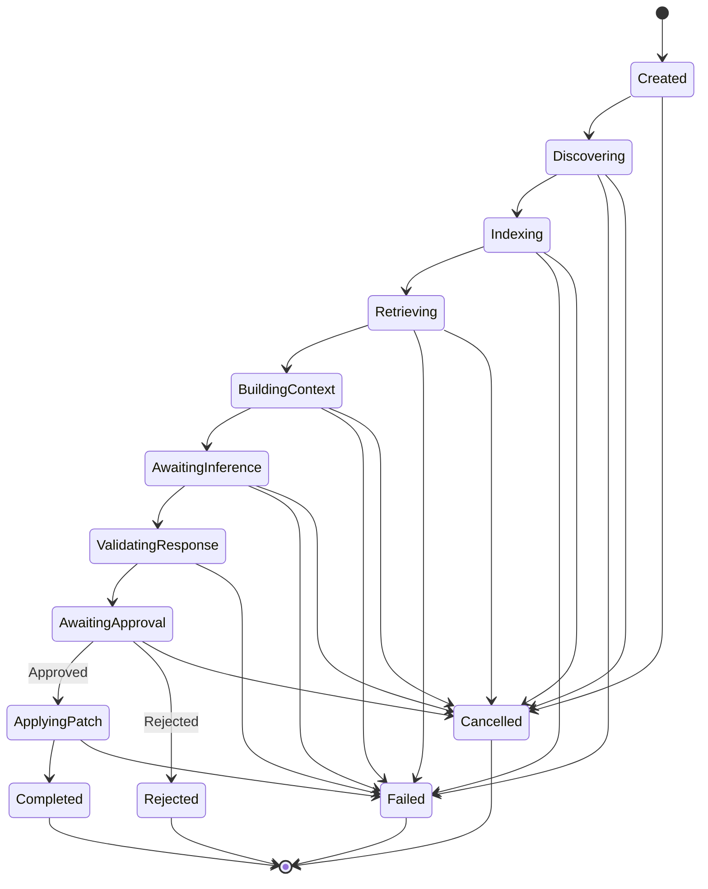

# Domain Model

Document ID: CF-004
Status: Draft
Version: 0.1.0
Owner: ContextForge Architecture Board
Language: English
Audience:

* Engineers
* Contributors
* Product Owners
* AI Agents

Normative: Yes

Depends On:

* CF-000 — AI-Native Specification
* CF-001 — Vision
* CF-002 — Product Requirements Document
* CF-003 — System Architecture

Related ADRs:

* ADR-0001 — Context-First Architecture
* ADR-0002 — Hexagonal Architecture
* ADR-0003 — Dependency Rule
* ADR-0004 — Feature-Based Module Organization

---

# Abstract

This document defines the canonical domain model of ContextForge.

It specifies the concepts, entities, value objects, relationships, invariants, lifecycle states, and domain terminology required by the Minimum Viable Product.

The domain model SHALL remain independent from:

* Programming languages.
* Persistence technologies.
* Inference providers.
* User interfaces.
* Serialization formats.
* External frameworks.

Implementation-specific classes, schemas, database structures, and transport models are intentionally excluded.

---

# Purpose

The purpose of the ContextForge domain model is to provide a stable vocabulary and a consistent representation of the information flowing through the system.

The model SHALL:

* Establish authoritative domain terms.
* Define ownership of domain information.
* Prevent semantic duplication.
* Preserve architectural boundaries.
* Support deterministic processing.
* Enable requirement traceability.
* Provide stable contracts for subsequent specifications.

---

# Domain Scope

The ContextForge domain includes the following areas:

1. Project discovery.
2. Project knowledge.
3. Task representation.
4. Context retrieval.
5. Context construction.
6. Inference exchange.
7. Patch review.
8. Patch application.
9. Execution reporting.

The domain SHALL NOT model:

* Language model internals.
* Provider billing systems.
* Source control hosting.
* IDE behavior.
* Operating system internals.
* User account management.
* Team collaboration.
* Cloud synchronization.

---

# Domain Principles

## DM-001 — Stable Identity

Every domain entity SHALL have a stable identity within its lifecycle.

---

## DM-002 — Explicit Ownership

Every domain artifact SHALL have one authoritative producer.

---

## DM-003 — Immutable Results

Completed domain results SHALL be immutable.

---

## DM-004 — Provider Independence

Provider-specific information SHALL NOT redefine Core domain semantics.

---

## DM-005 — Project Boundary

All project artifacts and patch targets SHALL remain associated with an authorized Project Root.

---

## DM-006 — Explainable Selection

Every artifact selected for context SHOULD retain an explicit selection rationale.

---

## DM-007 — Untrusted Inference Output

Inference responses SHALL be treated as untrusted external input until validated.

---

## DM-008 — Explicit Approval

A Patch Proposal SHALL NOT transition to application without explicit approval.

---

## DM-009 — Deterministic Identity

Domain identifiers derived from project artifacts SHOULD be reproducible whenever the underlying artifact has not changed.

---

## DM-010 — No Hidden Mutation

A domain object SHALL NOT be modified implicitly by another component.

---

# Domain Areas

The domain is divided into the following logical areas:

| Domain Area | Responsibility                                    |
| ----------- | ------------------------------------------------- |
| Project     | Represent the authorized software project         |
| Discovery   | Represent discovered project artifacts            |
| Knowledge   | Represent indexed project structure               |
| Task        | Represent the requested engineering operation     |
| Retrieval   | Represent relevance decisions                     |
| Context     | Represent the context delivered for inference     |
| Inference   | Represent provider-independent inference exchange |
| Patch       | Represent proposed and applied modifications      |
| Execution   | Represent the complete workflow outcome           |

These areas are logical boundaries and do not mandate physical packages or persistence structures.

---

# Core Entities

The MVP domain SHALL contain the following primary entities:

| Entity             | Purpose                                             |
| ------------------ | --------------------------------------------------- |
| Project            | Represents the authorized software project          |
| Project Artifact   | Represents an artifact contained in the project     |
| Project Index      | Represents structured knowledge about the project   |
| Task Specification | Represents the normalized user request              |
| Retrieval Result   | Represents the context selection decision           |
| Context Bundle     | Represents immutable inference context              |
| Inference Request  | Represents the provider-independent request         |
| Inference Response | Represents provider output                          |
| Patch Proposal     | Represents validated proposed modifications         |
| Patch Application  | Represents the result of applying an approved patch |
| Execution          | Represents one complete ContextForge operation      |

---

# Project

A Project represents the authorized software project operated on by ContextForge.

A Project SHALL contain:

* Project Identifier.
* Project Root.
* Display Name.
* Project Metadata.
* Exclusion Rules.
* Discovery State.

A Project MAY contain:

* Repository metadata.
* Detected languages.
* Configuration references.
* Version control metadata.

A Project SHALL define the security boundary for all artifact access and patch operations.

No Project Artifact SHALL reference a path outside its Project Root.

---

# Project Identifier

A Project Identifier is a stable identifier for a Project.

It SHALL:

* Uniquely identify the project within the active ContextForge environment.
* Remain independent from the project display name.
* Avoid embedding provider-specific information.

It MAY be derived from:

* A normalized project path.
* Repository identity.
* A generated stable identifier.

---

# Project Root

A Project Root is the authorized root location of a Project.

It SHALL:

* Be absolute after resolution.
* Be normalized before use.
* Exist before discovery begins.
* Define the maximum path boundary for project operations.

Relative project paths SHALL be resolved against the Project Root.

Path traversal beyond the Project Root SHALL be rejected.

---

# Project Metadata

Project Metadata describes non-content characteristics of a Project.

It MAY include:

* Repository type.
* Version control branch.
* Version control revision.
* Detected build system.
* Detected package managers.
* Detected languages.
* Discovery timestamp.

Project Metadata SHALL NOT contain provider credentials or unrelated user data.

---

# Exclusion Rule

An Exclusion Rule determines whether a project path is eligible for discovery and indexing.

An Exclusion Rule SHALL define:

* Match criteria.
* Rule source.
* Rule priority.
* Inclusion or exclusion behavior.

Rule sources MAY include:

* ContextForge defaults.
* Project configuration.
* Version control ignore files.
* User configuration.

Explicit security restrictions SHALL override ordinary inclusion rules.

---

# Project Artifact

A Project Artifact represents a discoverable item within a Project.

A Project Artifact SHALL contain:

* Artifact Identifier.
* Project-relative path.
* Artifact kind.
* Content classification.
* Availability state.
* Metadata.

A Project Artifact MAY represent:

* Source file.
* Configuration file.
* Documentation file.
* Directory.
* Manifest.
* Test file.
* Build file.
* Generated file.
* Binary file.
* Unsupported file.

A Project Artifact SHALL NOT require its full content to be loaded into memory.

---

# Artifact Identifier

An Artifact Identifier uniquely identifies a Project Artifact within a Project.

It SHOULD remain stable while:

* The project-relative path is unchanged.
* The artifact identity is unchanged.

An Artifact Identifier SHALL NOT depend on an inference provider.

---

# Artifact Kind

Artifact Kind classifies the structural role of a Project Artifact.

The canonical MVP kinds are:

* `source`
* `test`
* `configuration`
* `documentation`
* `manifest`
* `build`
* `directory`
* `generated`
* `binary`
* `unknown`

Language-specific specifications MAY refine these categories without changing their Core meaning.

---

# Content Classification

Content Classification describes whether and how an artifact may be processed.

The canonical classifications are:

* Text.
* Binary.
* Unsupported.
* Sensitive.
* Generated.
* Excluded.

An artifact MAY have more than one classification when the classifications are not contradictory.

---

# Artifact Metadata

Artifact Metadata MAY contain:

* File size.
* Modification time.
* Content hash.
* Detected language.
* Encoding.
* Line count.
* Symbol count.
* Import count.
* Generated status.
* Sensitivity indicators.

Artifact Metadata SHALL be treated as descriptive information rather than authoritative source content.

---

# Project Inventory

A Project Inventory is the immutable result of project discovery.

It SHALL contain:

* Project Identifier.
* Discovered Project Artifacts.
* Applied Exclusion Rules.
* Discovery diagnostics.
* Discovery timestamp.

It MAY contain:

* Detected language summary.
* Unsupported artifact summary.
* Repository metadata.

The Project Scanner SHALL be the authoritative producer of the Project Inventory.

A Project Inventory SHALL NOT contain task-specific relevance decisions.

---

# Project Index

A Project Index represents structured knowledge derived from a Project Inventory and eligible project content.

It SHALL contain:

* Project Identifier.
* Index Identifier.
* Index version.
* Indexed artifact references.
* Structural relationships.
* Index creation metadata.

It MAY contain:

* Symbol records.
* Import relationships.
* Dependency relationships.
* Reference relationships.
* File summaries.
* Language metadata.
* Searchable text units.
* Structural text units.

The Project Indexer SHALL be the authoritative producer of the Project Index.

A Project Index SHALL NOT contain provider-specific prompt formatting.

---

# Index Identifier

An Index Identifier uniquely identifies a generated Project Index.

It SHOULD allow the system to determine whether the index corresponds to the current project state.

It MAY incorporate:

* Project Identifier.
* Index format version.
* Project state fingerprint.
* Generation timestamp.

---

# Project State Fingerprint

A Project State Fingerprint represents the project state used to build an index.

It MAY be calculated from:

* Artifact paths.
* Artifact hashes.
* Repository revision.
* Index configuration.
* Indexer version.

Two indexes with different fingerprints SHALL NOT be assumed equivalent.

---

# Symbol

A Symbol represents a named structural element discovered inside a project artifact.

A Symbol SHALL contain:

* Symbol Identifier.
* Symbol name.
* Symbol kind.
* Declaring Artifact Identifier.
* Source location.

A Symbol MAY contain:

* Qualified name.
* Signature.
* Visibility.
* Parent symbol.
* Documentation reference.
* Language-specific metadata.

Canonical symbol kinds MAY include:

* Module.
* Namespace.
* Class.
* Interface.
* Function.
* Method.
* Property.
* Variable.
* Constant.
* Type.
* Import.

The Core domain SHALL permit language plugins to extend symbol kinds.

---

# Source Location

A Source Location identifies a region inside a Project Artifact.

It SHALL contain:

* Artifact Identifier.
* Start position.
* End position.

A position SHOULD contain:

* Line number.
* Column number.

The end position SHALL NOT precede the start position.

---

# Artifact Relationship

An Artifact Relationship represents a known relationship between project artifacts or symbols.

It SHALL contain:

* Relationship Identifier.
* Source reference.
* Target reference.
* Relationship kind.
* Evidence.

Canonical relationship kinds MAY include:

* Imports.
* References.
* Defines.
* Contains.
* Extends.
* Implements.
* Calls.
* Configures.
* Tests.
* Documents.

A relationship SHALL NOT be treated as proven when its evidence is speculative.

---

# Evidence

Evidence describes the deterministic or inferred basis for a domain decision.

Evidence SHALL identify its source.

Evidence types MAY include:

* Syntax analysis.
* Import analysis.
* Text match.
* Path match.
* User reference.
* Dependency analysis.
* Semantic similarity.
* Heuristic rule.

Evidence derived from generative inference SHALL be explicitly classified as inferred.

---

# Task Specification

A Task Specification represents the normalized engineering task requested by the user.

It SHALL contain:

* Task Identifier.
* Original Instruction.
* Task state.
* Creation metadata.

It MAY contain:

* Operation type.
* Explicit artifact references.
* Explicit symbol references.
* User constraints.
* Expected outcome.
* Validation expectations.
* Context budget.
* Provider constraints.

The Task Interpreter SHALL be the authoritative producer of the Task Specification.

The Original Instruction SHALL be preserved without semantic alteration.

---

# Task Identifier

A Task Identifier uniquely identifies one requested engineering task.

It SHALL remain stable throughout the execution associated with the task.

---

# Operation Type

Operation Type classifies the intended engineering action.

Canonical MVP operation types MAY include:

* Analyze.
* Explain.
* Modify.
* Fix.
* Refactor.
* Add.
* Remove.
* Test.
* Document.
* Unknown.

Operation Type SHALL NOT replace the Original Instruction.

When classification is uncertain, `unknown` SHALL be used instead of inventing intent.

---

# Task Constraint

A Task Constraint represents an explicit limitation imposed by the user or system.

Examples include:

* Modify only specified files.
* Preserve public interfaces.
* Avoid new dependencies.
* Use a specified language.
* Do not modify tests.
* Respect a token budget.

Task Constraints SHALL be preserved through retrieval, prompt construction, and patch validation when applicable.

---

# Context Budget

A Context Budget defines the maximum context allocation available to a retrieval and construction operation.

It MAY define limits for:

* Total tokens.
* Total characters.
* Number of artifacts.
* Number of excerpts.
* Maximum excerpt size.

A Context Budget SHALL NOT require complete consumption.

The Context Retriever and Context Builder SHOULD use less than the maximum when sufficient context can be produced.

---

# Retrieval Candidate

A Retrieval Candidate represents a project artifact or excerpt considered for inclusion in task context.

It SHALL contain:

* Candidate reference.
* Candidate type.
* Evidence.
* Eligibility state.

It MAY contain:

* Relevance score.
* Rank.
* Estimated size.
* Related candidates.
* Exclusion reasons.

A Retrieval Candidate is not part of a Context Bundle unless selected.

---

# Relevance Score

A Relevance Score represents the evaluated relevance of a candidate to a Task Specification.

A Relevance Score SHALL:

* Be comparable only within the retrieval strategy that produced it.
* Preserve its scoring source.
* Avoid implying universal probability.

The domain SHALL NOT require one scoring algorithm.

---

# Selection Rationale

A Selection Rationale explains why a candidate was included or excluded.

It SHALL contain:

* Decision.
* Primary reason.
* Supporting Evidence.

It MAY contain:

* Score.
* Rank.
* Applied rule.
* Related task reference.
* Related artifact reference.

Canonical decisions are:

* Selected.
* Excluded.
* Deferred.

---

# Retrieval Result

A Retrieval Result represents the completed context selection decision for a Task Specification.

It SHALL contain:

* Retrieval Identifier.
* Task Identifier.
* Project Index Identifier.
* Selected context items.
* Selection rationale.
* Applied Context Budget.
* Retrieval diagnostics.

It MAY contain:

* Excluded candidates.
* Ranking information.
* Retrieval strategy metadata.
* Coverage warnings.
* Ambiguity warnings.

The Context Retriever SHALL be the authoritative producer of the Retrieval Result.

A finalized Retrieval Result SHALL be immutable.

---

# Context Item

A Context Item represents one unit approved for inclusion in a Context Bundle.

A Context Item SHALL contain:

* Context Item Identifier.
* Source Artifact Identifier.
* Content or content reference.
* Selection Rationale.
* Context Item type.

It MAY contain:

* Source Location.
* Symbol reference.
* Relationship information.
* Content hash.
* Estimated token count.
* Ordering priority.

Canonical Context Item types MAY include:

* Full artifact.
* Source excerpt.
* Symbol definition.
* Related declaration.
* Configuration excerpt.
* Structural summary.
* Dependency information.
* Task-provided content.

---

# Context Bundle

A Context Bundle is the immutable package of task-relevant information delivered for prompt construction.

It SHALL contain:

* Context Bundle Identifier.
* Task Specification reference.
* Ordered Context Items.
* Bundle metadata.
* Construction diagnostics.

It MAY contain:

* Project summary.
* Selection explanations.
* Context size measurements.
* Omission warnings.
* Dependency summaries.

The Context Builder SHALL be the authoritative producer of the Context Bundle.

A Context Bundle SHALL NOT include content that was not authorized by the Retrieval Result, except for system-defined metadata and the Task Specification.

A finalized Context Bundle SHALL be immutable.

---

# Context Bundle Identifier

A Context Bundle Identifier uniquely identifies one finalized Context Bundle.

It SHOULD permit correlation with:

* Task Specification.
* Retrieval Result.
* Inference Request.
* Execution.

---

# Context Size

Context Size represents the measured or estimated size of a Context Bundle.

It MAY include:

* Character count.
* Byte count.
* Line count.
* Estimated token count.
* Context Item count.

Estimated token counts SHALL identify the estimation strategy when available.

---

# Inference Request

An Inference Request represents the provider-independent request submitted through the Provider Port.

It SHALL contain:

* Inference Request Identifier.
* Task Identifier.
* Context Bundle Identifier.
* Instruction content.
* Context content.
* Expected response contract.

It MAY contain:

* Model preference.
* Temperature preference.
* Maximum output size.
* Provider capability requirements.
* Correlation metadata.

Provider-specific transport fields SHALL remain outside the Core Inference Request or within an explicitly isolated extension structure.

---

# Expected Response Contract

An Expected Response Contract defines the response structure requested from an inference provider.

For modification tasks, it SHALL specify a structured patch-compatible response.

It MAY define:

* Accepted response format.
* Required fields.
* Patch format.
* Explanation requirements.
* Prohibited operations.

The Expected Response Contract SHALL be provider-independent.

---

# Inference Response

An Inference Response represents the raw or normalized output returned through the Provider Port.

It SHALL contain:

* Inference Response Identifier.
* Inference Request Identifier.
* Response content.
* Completion state.
* Provider metadata.

It MAY contain:

* Usage metadata.
* Model identifier.
* Stop reason.
* Provider diagnostics.
* Timing metadata.

An Inference Response SHALL be treated as untrusted until processed by the Patch Engine or another appropriate validator.

---

# Provider Metadata

Provider Metadata describes the provider execution that produced an Inference Response.

It MAY contain:

* Provider identifier.
* Model identifier.
* Provider request identifier.
* Execution duration.
* Input token count.
* Output token count.
* Provider-reported status.

Provider Metadata SHALL NOT alter Core task semantics.

---

# Proposed Change

A Proposed Change represents one requested modification to a Project Artifact.

It SHALL contain:

* Proposed Change Identifier.
* Target Artifact reference.
* Change operation.
* Proposed content or patch fragment.
* Validation state.

Canonical change operations are:

* Create.
* Modify.
* Delete.
* Rename.

Rename MAY be excluded from the initial implementation while remaining valid in the domain.

A Proposed Change SHALL NOT target a path outside the Project Root.

---

# Patch Proposal

A Patch Proposal represents a validated, reviewable collection of Proposed Changes.

It SHALL contain:

* Patch Proposal Identifier.
* Task Identifier.
* Inference Response Identifier.
* Proposed Changes.
* Validation Result.
* Approval state.

It MAY contain:

* Human-readable summary.
* Warnings.
* Diff representation.
* Affected artifact count.
* Estimated modification size.

The Patch Engine SHALL be the authoritative producer of the Patch Proposal.

A Patch Proposal SHALL NOT be applied while its Approval State is not `approved`.

---

# Validation Result

A Validation Result represents the outcome of validating provider-proposed modifications.

It SHALL contain:

* Validation state.
* Validation findings.
* Validation timestamp.

Canonical validation states are:

* Valid.
* Invalid.
* Valid with warnings.

A Patch Proposal with an `invalid` Validation Result SHALL NOT be eligible for approval or application.

---

# Validation Finding

A Validation Finding represents one validation observation.

It SHALL contain:

* Finding severity.
* Finding code.
* Description.
* Related Proposed Change when applicable.

Canonical severities are:

* Information.
* Warning.
* Error.

An Error finding SHALL prevent patch application.

---

# Approval State

Approval State represents the user's decision regarding a Patch Proposal.

Canonical states are:

* Pending.
* Approved.
* Rejected.

Only an explicit user action SHALL transition a Patch Proposal from `pending` to `approved` or `rejected`.

Approval SHALL apply to a specific immutable Patch Proposal.

Any modification to the proposal SHALL invalidate the previous approval.

---

# Patch Application

A Patch Application represents one attempt to apply an approved Patch Proposal.

It SHALL contain:

* Patch Application Identifier.
* Patch Proposal Identifier.
* Application state.
* Change results.
* Application timestamp.

It MAY contain:

* Backup references.
* Rollback information.
* Failure diagnostics.
* Resulting project fingerprint.

The Patch Engine SHALL be the authoritative producer of the Patch Application.

---

# Patch Application State

Canonical Patch Application states are:

* Not Started.
* Applying.
* Applied.
* Partially Applied.
* Failed.
* Cancelled.

A Patch Application SHALL NOT enter `applying` unless:

* The Patch Proposal is valid.
* The Patch Proposal is approved.
* The Project Root remains authorized.
* Target artifacts satisfy required preconditions.

A successful application SHALL end in `applied`.

The MVP SHOULD avoid partial application through atomic or prevalidated write behavior where feasible.

---

# Change Result

A Change Result describes the result of applying one Proposed Change.

It SHALL contain:

* Proposed Change Identifier.
* Change result state.
* Target Artifact reference.
* Diagnostic information when unsuccessful.

Canonical result states are:

* Applied.
* Skipped.
* Failed.

---

# Execution

An Execution represents one complete ContextForge workflow initiated for a Task Specification.

It SHALL contain:

* Execution Identifier.
* Project Identifier.
* Task Identifier.
* Execution state.
* Stage records.
* Start time.

It MAY contain:

* End time.
* Project Inventory reference.
* Project Index reference.
* Retrieval Result reference.
* Context Bundle reference.
* Inference Request reference.
* Inference Response reference.
* Patch Proposal reference.
* Patch Application reference.
* Diagnostics.
* Metrics.

The Application Orchestrator SHALL own the Execution lifecycle.

---

# Execution State

Canonical Execution states are:

* Created.
* Discovering.
* Indexing.
* Retrieving.
* Building Context.
* Awaiting Inference.
* Validating Response.
* Awaiting Approval.
* Applying Patch.
* Completed.
* Rejected.
* Failed.
* Cancelled.

An Execution SHALL have exactly one current state.

Terminal states are:

* Completed.
* Rejected.
* Failed.
* Cancelled.

A terminal Execution SHALL NOT return to a non-terminal state.

---

# Stage Record

A Stage Record represents the execution of one workflow stage.

It SHALL contain:

* Stage identifier.
* Stage type.
* Stage state.
* Start time.

It MAY contain:

* End time.
* Input references.
* Output references.
* Diagnostics.
* Measurements.

Canonical stage states are:

* Pending.
* Running.
* Completed.
* Failed.
* Skipped.
* Cancelled.

---

# Diagnostic

A Diagnostic represents information produced during domain processing.

It SHALL contain:

* Diagnostic code.
* Severity.
* Message.
* Producing capability.

It MAY contain:

* Related entity.
* Related artifact.
* Corrective guidance.
* Technical details.

Diagnostics SHALL NOT expose secrets or provider credentials.

---

# Domain Relationships

The principal relationships are:

```text
Project
  |
  +-- contains --> Project Artifact
  |
  +-- produces --> Project Inventory
                      |
                      +-- produces --> Project Index
                                          |
Task Specification -----------------------+
  |                                       |
  +----------------> Retrieval Result <----+
                           |
                           +-- contains --> Context Item
                           |
                           +-- produces --> Context Bundle
                                               |
                                               +-- produces --> Inference Request
                                                                    |
                                                                    +-- produces --> Inference Response
                                                                                         |
                                                                                         +-- produces --> Patch Proposal
                                                                                                              |
                                                                                                              +-- requires --> Approval
                                                                                                              |
                                                                                                              +-- produces --> Patch Application
```

An Execution correlates all domain artifacts created during one workflow.

---

# Aggregate Boundaries

The MVP SHALL recognize the following logical aggregate boundaries:

## Project Aggregate

Root:

* Project.

Contains or references:

* Project Metadata.
* Exclusion Rules.
* Project Artifacts.
* Project Inventory references.
* Project Index references.

The Project Aggregate enforces project path boundaries.

---

## Task Aggregate

Root:

* Task Specification.

Contains:

* Original Instruction.
* Task Constraints.
* Explicit references.
* Context Budget.

The Task Aggregate preserves user intent.

---

## Retrieval Aggregate

Root:

* Retrieval Result.

Contains:

* Retrieval Candidates when retained.
* Selected Context Items.
* Selection Rationales.
* Retrieval diagnostics.

The Retrieval Aggregate owns context selection decisions.

---

## Context Aggregate

Root:

* Context Bundle.

Contains:

* Ordered Context Items.
* Context Size.
* Construction diagnostics.

The Context Aggregate owns the finalized inference context.

---

## Patch Aggregate

Root:

* Patch Proposal.

Contains:

* Proposed Changes.
* Validation Result.
* Approval State.

References:

* Patch Application attempts.

The Patch Aggregate enforces validation and approval invariants.

---

## Execution Aggregate

Root:

* Execution.

Contains:

* Execution state.
* Stage Records.
* Diagnostics.
* References to workflow outputs.

The Execution Aggregate coordinates lifecycle state without owning the internal business rules of other aggregates.

---

# Domain Invariants

The following invariants SHALL always hold.

## INV-001 — Project Containment

Every Project Artifact path SHALL resolve inside its Project Root.

---

## INV-002 — Inventory Ownership

Every Project Inventory SHALL belong to exactly one Project.

---

## INV-003 — Index Ownership

Every Project Index SHALL reference exactly one Project and one compatible Project Inventory or project state.

---

## INV-004 — Task Preservation

The Original Instruction SHALL remain available throughout the Execution.

---

## INV-005 — Retrieval Traceability

Every selected Context Item SHALL have a Selection Rationale.

---

## INV-006 — Bundle Authorization

Every project-derived Context Item in a Context Bundle SHALL originate from the corresponding Retrieval Result.

---

## INV-007 — Bundle Immutability

A finalized Context Bundle SHALL NOT change.

---

## INV-008 — Request Correlation

Every Inference Response SHALL reference the Inference Request that produced it.

---

## INV-009 — Response Distrust

An Inference Response SHALL NOT directly modify project artifacts.

---

## INV-010 — Patch Validation

Every Patch Proposal SHALL have a Validation Result.

---

## INV-011 — Valid Approval

Only a valid Patch Proposal MAY transition to `approved`.

---

## INV-012 — Explicit Approval

Only explicit user authorization MAY approve a Patch Proposal.

---

## INV-013 — Approval Specificity

Approval SHALL apply only to the exact immutable Patch Proposal presented to the user.

---

## INV-014 — Authorized Application

A Patch Application SHALL reference an approved Patch Proposal.

---

## INV-015 — Target Containment

Every Proposed Change target SHALL remain inside the authorized Project Root.

---

## INV-016 — Terminal Execution

A terminal Execution state SHALL NOT transition to another state.

---

## INV-017 — Single Producer

Every completed domain result SHALL have one authoritative producing capability.

---

## INV-018 — Provider Isolation

Provider-specific metadata SHALL NOT alter Project, Task, Retrieval, Context, or Patch semantics.

---

# Lifecycle Overview



---

# Equality Semantics

Entities SHALL be compared by identity.

Value objects SHALL be compared by their complete semantic value.

Examples of entities include:

* Project.
* Project Artifact.
* Project Index.
* Task Specification.
* Retrieval Result.
* Context Bundle.
* Patch Proposal.
* Execution.

Examples of value objects include:

* Project Root.
* Source Location.
* Context Budget.
* Relevance Score.
* Selection Rationale.
* Validation Finding.
* Project State Fingerprint.

---

# Immutability Rules

The following objects SHALL be immutable after finalization:

* Project Inventory.
* Project Index.
* Task Specification.
* Retrieval Result.
* Context Bundle.
* Inference Request.
* Inference Response.
* Patch Proposal content.
* Validation Result.
* Completed Stage Record.

Lifecycle objects MAY transition through controlled state changes:

* Execution.
* Patch Proposal Approval State.
* Patch Application.
* Stage Record before completion.

State transitions SHALL occur only through the capability that owns the lifecycle.

---

# Domain Events

The domain MAY expose events to represent completed state transitions.

Canonical events MAY include:

* Project Discovered.
* Project Indexed.
* Task Interpreted.
* Context Retrieved.
* Context Bundle Built.
* Inference Requested.
* Inference Completed.
* Patch Validated.
* Patch Approved.
* Patch Rejected.
* Patch Applied.
* Execution Failed.
* Execution Completed.

Domain events SHALL describe completed facts.

The MVP SHALL NOT require an external event broker.

In-process event handling MAY be used when necessary without making event-driven infrastructure mandatory.

---

# Failure Model

A Domain Failure represents an expected failure condition recognized by the Core.

A Domain Failure SHALL contain:

* Failure code.
* Failure category.
* Human-readable message.
* Producing capability.
* Recoverability indication.

It MAY contain:

* Related entity.
* Related artifact.
* Corrective guidance.
* Original adapter diagnostic.

Canonical failure categories are:

* Validation.
* Configuration.
* Discovery.
* Indexing.
* Retrieval.
* Context Construction.
* Provider.
* Patch.
* Authorization.
* Application.
* Internal.

Failures caused by programming defects SHALL NOT be misclassified as ordinary domain failures.

---

# Sensitive Content

A Project Artifact MAY be classified as sensitive.

Sensitive classification MAY result from:

* Explicit project configuration.
* Known secret-file patterns.
* Credential indicators.
* User-defined rules.

Sensitive content SHALL NOT be sent to a remote provider unless explicitly permitted by configuration.

The sensitivity decision and its source SHOULD be retained as Evidence.

Detailed policy belongs to CF-013.

---

# Serialization Boundary

Domain models SHALL remain independent from serialization formats.

Adapters MAY serialize domain information as:

* JSON.
* YAML.
* MessagePack.
* Plain text.
* Provider-specific payloads.

Serialized data SHALL NOT become the authoritative domain representation.

Transport models SHOULD be converted at system boundaries.

---

# Persistence Boundary

The domain SHALL NOT assume that any entity is stored in:

* A relational database.
* A document database.
* A vector database.
* A local file.
* Memory.

Persistence decisions belong to later specifications.

A Project Index MAY be rebuilt, cached, or persisted without changing its domain meaning.

---

# Provider Boundary

Provider capabilities SHALL be represented outside the domain through provider contracts and metadata.

The domain MAY express provider requirements such as:

* Structured output support.
* Maximum context capacity.
* Maximum output capacity.
* Streaming availability.

The domain SHALL NOT contain provider-specific API parameters as mandatory Core fields.

---

# Traceability

| Domain Concept        | Architectural Capability                     |
| --------------------- | -------------------------------------------- |
| Project               | Project Scanner and Application Orchestrator |
| Project Artifact      | Project Scanner                              |
| Project Inventory     | Project Scanner                              |
| Project Index         | Project Indexer                              |
| Symbol                | Project Indexer                              |
| Artifact Relationship | Project Indexer                              |
| Task Specification    | Task Interpreter                             |
| Retrieval Candidate   | Context Retriever                            |
| Retrieval Result      | Context Retriever                            |
| Selection Rationale   | Context Retriever                            |
| Context Item          | Context Retriever and Context Builder        |
| Context Bundle        | Context Builder                              |
| Inference Request     | Prompt Builder                               |
| Inference Response    | Provider Port                                |
| Proposed Change       | Patch Engine                                 |
| Patch Proposal        | Patch Engine                                 |
| Validation Result     | Patch Engine                                 |
| Approval State        | CLI Adapter and Patch Engine                 |
| Patch Application     | Patch Engine                                 |
| Execution             | Application Orchestrator                     |
| Stage Record          | Application Orchestrator                     |

---

# Naming Rules

Canonical domain names defined in this document SHALL be used consistently throughout subsequent specifications and implementation.

The following terms SHALL NOT be used as interchangeable synonyms:

| Canonical Term     | Avoid As Equivalent             |
| ------------------ | ------------------------------- |
| Project Artifact   | File item, repository object    |
| Project Inventory  | Scan index, file index          |
| Project Index      | Repository cache, project map   |
| Task Specification | Prompt, command                 |
| Retrieval Result   | Search result, context result   |
| Context Item       | Snippet object, selected file   |
| Context Bundle     | Prompt context, context payload |
| Inference Request  | Provider prompt                 |
| Inference Response | Model answer                    |
| Patch Proposal     | Suggested code                  |
| Patch Application  | Patch execution                 |
| Execution          | Session, run context            |

A user-facing interface MAY use simplified labels, but internal specifications SHALL preserve canonical terminology.

---

# Validation Criteria

This domain model SHALL be considered valid when:

* Every primary architectural data artifact has a canonical domain definition.
* Every entity has a clear identity.
* Every immutable result has one authoritative producer.
* All patch operations preserve project boundaries.
* Context selection remains explainable.
* Provider output remains isolated from direct project modification.
* Explicit approval is required before patch application.
* Domain semantics remain independent from providers, storage, frameworks, and user interfaces.
* Subsequent specifications can reference these concepts without redefining them.

---

# Completion Statement

The ContextForge domain model is complete when the MVP workflow can represent project discovery, project knowledge, user intent, context selection, context construction, inference exchange, patch validation, explicit approval, patch application, and execution reporting without relying on implementation-specific technologies.
